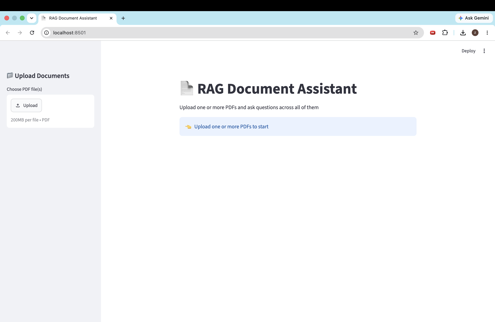
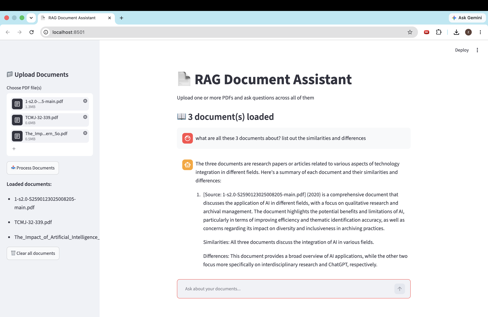
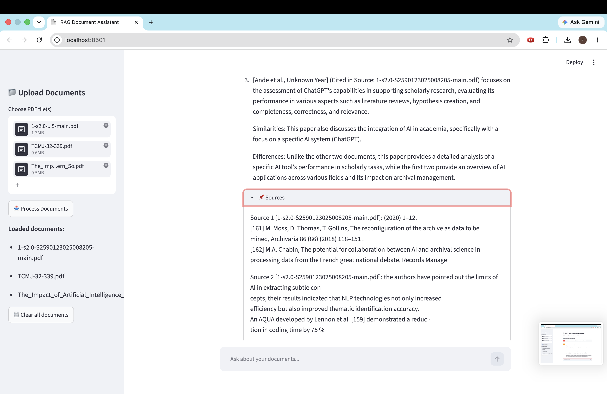

# 📄 RAG Document Assistant

A Streamlit app that lets you upload one or more PDFs and ask natural-language questions about them. Answers are generated using **Retrieval-Augmented Generation (RAG)** — the app retrieves the most relevant chunks across your uploaded documents and grounds the LLM's response in that context, reducing hallucination and keeping answers traceable back to the source text.

## ✨ Features

- **Multi-PDF upload** — upload and query across multiple documents at once
- **Smart chunking** — splits documents into overlapping chunks for better retrieval context
- **Semantic search** — uses FAISS + HuggingFace sentence embeddings (`all-MiniLM-L6-v2`) to find the most relevant passages for a given question
- **Source-aware retrieval** — every chunk is tagged with its source filename, so answers can cite which specific document they came from
- **Local LLM inference** — answers are generated via Ollama running Mistral locally (no external API calls for generation)
- **Source transparency** — every answer comes with the exact source passages it was derived from, viewable in an expandable panel
- **Chat-style UI** — persistent conversation history within a session, with an option to clear loaded documents and start fresh

## 🛠️ Tech Stack

| Layer | Tool |
|---|---|
| UI | Streamlit |
| Orchestration | LangChain |
| Embeddings | HuggingFace `sentence-transformers/all-MiniLM-L6-v2` |
| Vector store | FAISS |
| LLM | Ollama (Mistral) |
| PDF parsing | PyPDF2 |

## 📸 Screenshots

**Starting page**



**Asking a question**





## 🚀 Getting Started

### Prerequisites

- Python 3.9+
- Ollama installed locally (https://ollama.com), with the Mistral model pulled:

```
ollama pull mistral
ollama serve
```

### Installation

```
git clone https://github.com/zzzzaaaacccc/AI-RAG-document-assistant.git
cd AI-RAG-document-assistant
pip install -r requirements.txt
```

### Run

```
streamlit run app.py
```

Then open the local URL Streamlit prints (usually http://localhost:8501), upload one or more PDFs from the sidebar, and start asking questions.

## 📂 Project Structure

```
.
├── app.py              # Streamlit app (upload, chunk, embed, retrieve, chat UI)
├── requirements.txt
├── screenshots/
│   ├── starting_page.png
│   ├── response.png
│   └── response_part2.png
└── README.md
```

## 🔮 Possible Improvements

- Persist vector stores to disk so documents don't need to be re-processed each session
- Add per-document filtering (query only a subset of loaded files)
- Swap in a hosted LLM option (e.g. Gemini) as a configurable alternative to local Ollama
- Add streaming responses for a more real-time chat feel
