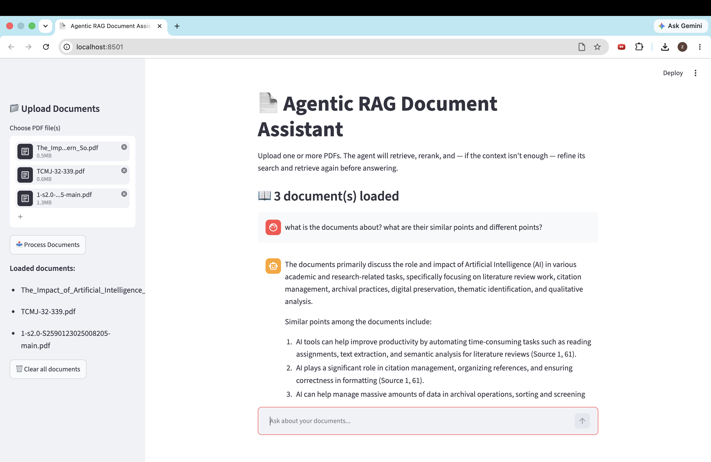
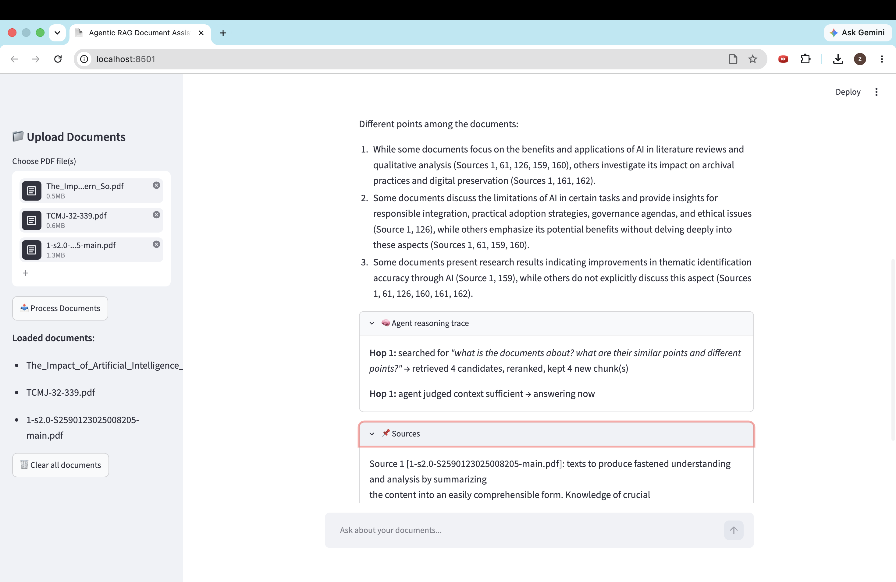

# Agentic RAG Document Assistant

A Streamlit application that lets you upload one or more PDFs and ask natural-language questions about them. Unlike a standard single-pass RAG pipeline, this app uses an **agentic, multi-hop retrieval loop**: the model assesses whether it has enough context to answer, and if not, autonomously refines its search query and retrieves again — up to several hops — before generating a final, source-grounded answer.

## Features

- **Multi-PDF upload** — upload and query across multiple documents at once
- **Agentic multi-hop retrieval** — the LLM decides after each retrieval step whether it has sufficient context, or whether to generate a refined query and search again (up to 3 hops)
- **Two-stage ranking pipeline** — FAISS embedding similarity search narrows candidates, then a cross-encoder (`cross-encoder/ms-marco-MiniLM-L-6-v2`) reranks them for higher relevance before they're used as context
- **Guaranteed multi-document coverage** — on broad questions ("summarize all documents", "compare these"), the agent explicitly pulls context from every loaded file rather than relying on similarity search alone, which can otherwise let quieter documents get crowded out by louder ones
- **Persistent per-file caching** — each uploaded file is hashed and its embeddings are cached to disk, so re-uploading a previously processed file skips extraction and re-embedding entirely
- **Visible reasoning trace** — every answer includes an expandable panel showing exactly what the agent searched for at each hop, how long each step took, and why it decided to stop or continue
- **Local LLM inference** — answers are generated via Ollama running Mistral locally (no external API calls for generation)
- **Source-aware answers** — every answer cites which document(s) it was derived from, with the exact source passages viewable in an expandable panel
- **Chat-style UI** — persistent conversation history within a session, with options to clear loaded documents or clear the on-disk cache

## Tech Stack

| Layer | Tool |
|---|---|
| UI | Streamlit |
| Orchestration / agent loop | LangChain + custom multi-hop controller |
| Embeddings | HuggingFace `sentence-transformers/all-MiniLM-L6-v2` |
| Vector store | FAISS |
| Reranking | Cross-encoder (`cross-encoder/ms-marco-MiniLM-L-6-v2`) |
| LLM | Ollama (Mistral), via `langchain-ollama` |
| PDF parsing | PyPDF2 |

## How the agent works

1. **Retrieve** — the current query is embedded and FAISS returns the top candidate chunks across all loaded documents. On the first hop, if multiple documents are loaded, the agent also runs a per-document retrieval pass to guarantee every file contributes at least a few chunks.
2. **Rerank** — a cross-encoder scores each (query, chunk) pair directly for relevance, keeping only the strongest matches.
3. **Assess** — the LLM is asked whether the accumulated context is sufficient to answer the original question.
4. **Refine or answer** — if context is insufficient, the LLM generates a more targeted follow-up query and the loop repeats (up to 3 hops); otherwise, it proceeds to generate the final answer.
5. **Synthesize** — a final answer is generated from all accumulated context, citing which source document(s) support it.


## Screenshots

**Starting page**


**Asking a question**





## Getting Started

### Prerequisites

- Python 3.9+
- Ollama installed locally (https://ollama.com), with the Mistral model pulled:
```bash
  ollama pull mistral
  ollama serve
```

### Installation

```bash
git clone https://github.com/zzzzaaaacccc/AI-RAG-document-assistant.git
cd AI-RAG-document-assistant
python3 -m venv venv
source venv/bin/activate   # Windows: venv\Scripts\activate
pip install -r requirements.txt
```

### Run

```bash
streamlit run app.py
```

Then open the local URL Streamlit prints (usually `http://localhost:8501`), upload one or more PDFs from the sidebar, and start asking questions.


## Project Structure

```
.
├── app.py              # Streamlit app: upload, chunk, embed, agentic retrieval loop, rerank, chat UI
├── requirements.txt
├── screenshots/
│   ├── starting_page.png
│   ├── response.png
│   └── response_part2.png
└── README.md
```

## Why local retrieval instead of just asking ChatGPT or Claude directly

A general-purpose chat assistant is the better tool for most questions — more capable, faster to set up, no infrastructure required. This project solves a narrower problem: asking questions against a specific, possibly private, possibly large set of documents, with full visibility into where each answer came from.

- **Data never leaves the machine** — embeddings, retrieval, and generation all run locally, which matters for contracts, internal documents, or anything that can't be pasted into a third-party chat interface.
- **No per-message cost or rate limits** — once set up, querying is free and unlimited.
- **Answers are grounded and traceable** — every answer comes with the exact source chunks and a visible trace of what was searched and why, rather than an opaque summary.
- **Works offline** — no internet connection needed once models are downloaded.
- **Fully inspectable and tunable** — chunk size, retrieval hops, reranking, and coverage logic are all visible and adjustable in code.

**Tradeoffs to be upfront about:** a local 7B model like Mistral is meaningfully weaker at reasoning and synthesis than frontier models such as GPT or Claude, local inference is slower (especially on CPU), and this requires ongoing setup/maintenance that a hosted chat product doesn't. This is the right tool when document sensitivity, volume, or traceability matter more than best-possible answer quality — not a general replacement for a hosted assistant.

## Possible Improvements

- Add per-document filtering in the chat UI (query only a subset of loaded files, not just guaranteed coverage across all of them)
- Swap in a hosted LLM option (e.g. Gemini) as a configurable alternative to local Ollama
- Add streaming responses for a more real-time chat feel
- Add evaluation metrics (retrieval precision, answer faithfulness) to quantify agent performance
- Parallelize per-file processing (currently sequential) to speed up multi-document uploads
- Add evaluation metrics (retrieval precision, answer faithfulness) to quantify agent performance
